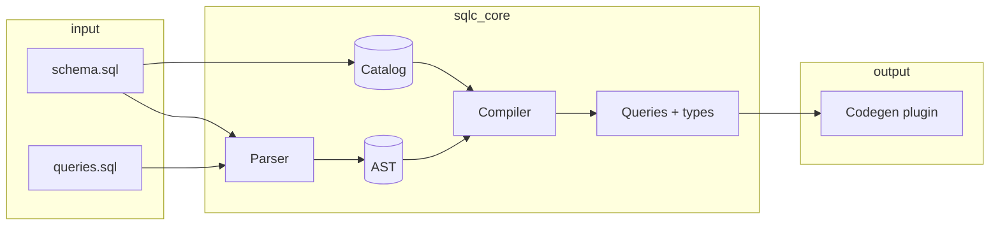
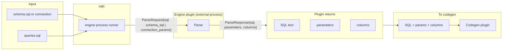
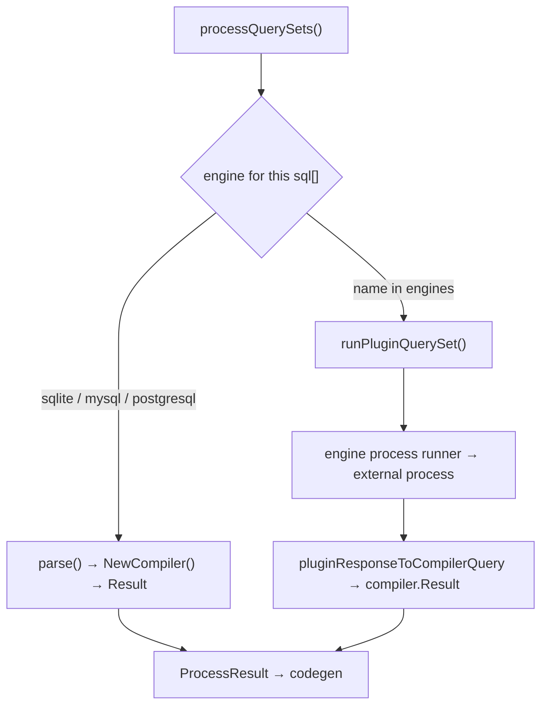

# Add database engine plugins (external engines)

This PR adds support for **database engine plugins**: external processes that implement a single `Parse` RPC and allow sqlc to work with databases that are not built-in (e.g. CockroachDB, TiDB, or custom SQL dialects). The plugin contract is deliberately minimal: no AST, no compiler in the middle, and a straight path from plugin output to codegen.

---

## Pipeline: built-in engine vs external plugin

### Built-in engine (PostgreSQL, MySQL, SQLite)



- Parser produces an **intermediate AST**.
- **Compiler** resolves types, expands `*`, validates against catalog, produces Queries.
- Codegen receives already-compiled queries and types.

### External engine plugin



- **No intermediate AST**: the plugin returns already “resolved” data (SQL text, parameters, columns).
- **No compiler** for the plugin path: type resolution, `*` expansion, and validation are the plugin’s job. sqlc does not run the built-in compiler on plugin output.
- Data from the plugin is passed through to the **codegen plugin** as-is (or after a thin adapter that today still produces a synthetic `[]ast.Statement` for compatibility; the useful payload is `sql` + `parameters` + `columns`).

So: for external engines, the pipeline is effectively **schema + queries → engine plugin (Parse) → (sql, parameters, columns) → codegen**, with no AST and no compiler in between.

### Where the branch is taken (generate only)

The choice between “built-in engine” and “external plugin” happens **once per `sql[]` block**, when the compiler for that block is created. In the current implementation the branch is taken in **`internal/cmd/process.go`**: built-in engines use parse → compiler; plugin engines use **`runPluginQuerySet`** in **`plugin_engine_path.go`** (engine process runner, no compiler). Vet has no plugin-specific logic; for plugin-engine blocks it fails with compiler error "unknown engine".



**Call flow (built-in path)**

1. **`internal/cmd/generate.go`**  
   For each entry in `sql[]`, `parse()` is called with that block’s `config.SQL` (which includes `conf.Engine` = value of `engine: ...`).

2. **`parse()`** calls **`compiler.NewCompiler(sql, combo, parserOpts)`**  
   So every SQL block gets its own compiler, and the engine is selected inside `NewCompiler`.

3. **`internal/compiler/engine.go`**, **`NewCompiler(conf config.SQL, combo config.CombinedSettings, ...)`**  
   **Current code**: branch is in **`process.go`**, not here. **`NewCompiler`** only has sqlite/mysql/postgresql cases; `default` returns "unknown engine". Legacy snippet (branch used to be here):

   ```go
   switch conf.Engine {
   case config.EngineSQLite:
       // built-in: c.parser = sqlite.NewParser(), c.catalog = sqlite.NewCatalog(), ...
   case config.EngineMySQL:
       // built-in: dolphin parser + catalog
   case config.EnginePostgreSQL:
       // built-in: postgresql parser + catalog
   default:
       // “Other” engine name → treat as plugin
       if enginePlugin, found := config.FindEnginePlugin(&combo.Global, string(conf.Engine)); found {
           eng, _ := createPluginEngine(enginePlugin, combo.Dir)  // plugin.NewPluginEngine or WASM
           c.parser = eng.Parser()   // ProcessRunner, which calls the external process
           c.catalog = eng.Catalog()
           // ...
       } else {
           return nil, fmt.Errorf("unknown engine: %s ... add it to the 'engines' section ...")
       }
   }
   ```

- **Built-in path**: `conf.Engine` is `"sqlite"`, `"mysql"`, or `"postgresql"` → the switch hits one of the first three cases; parser and catalog are the in-tree implementations.
- **Plugin engines**: the compiler does *not* load plugin engines. For `engine: myplugin` (name under `engines:`), **generate** uses the plugin path in cmd (`runPluginQuerySet` → engine process runner in **`plugin_engine_path.go`**); **vet** fails with compiler error "unknown engine" (no plugin-specific code in vet). (“unknown engine”.

**Summary:** Built-in path = **`internal/compiler/engine.go`**; plugin path = **`internal/cmd/plugin_engine_path.go`**.

---

## No intermediate AST for external plugins

The plugin does **not** return an AST or “statements + AST”:

- **Request**: query text + schema (or connection).
- **Response**: `sql` (possibly with `*` expanded), `parameters`, `columns`.

The plugin is the single place that defines how the query is interpreted. sqlc does not parse or analyze that SQL again; it forwards the plugin’s `ParseResponse` toward codegen. Any internal use of `[]ast.Statement` for the plugin path is a compatibility shim; the semantics are driven by the plugin’s `sql` / `parameters` / `columns`.

---

## No compiler for external plugins

The built-in **compiler** (catalog, type resolution, validation, expansion of `*`) is **not** used for external engine plugins:

- The plugin is responsible for:
  - Resolving parameter and column types (using schema or DB).
  - Expanding `SELECT *` if desired.
  - Emitting whatever shape of `parameters` and `columns` the codegen expects.
- sqlc does not run the compiler on plugin output; it passes that output through to codegen. So “compiler” is only in the built-in-engine path.

---

## What is sent to and returned from the plugin

**Invocation**: one RPC, `Parse`, over stdin/stdout (protobuf).  
Example: `sqlc-engine-mydb parse` with `ParseRequest` on stdin and `ParseResponse` on stdout.

### Sent to the plugin (`ParseRequest`)

| Field             | Description |
|-------------------|-------------|
| `sql`             | Query text to parse (from `queries.sql` or the current batch). |
| `schema_sql`      | *(optional)* Contents of the schema file(s), e.g. concatenated `schema.sql`. |
| `connection_params` | *(optional)* DSN + options for “database-only” mode when schema is taken from the DB. |

Exactly one of `schema_sql` or `connection_params` is used per request, depending on how the project is configured (see below).

### Returned from the plugin (`ParseResponse`)

| Field        | Description |
|-------------|-------------|
| `sql`       | Processed SQL. Can be the same as input, or e.g. `SELECT *` expanded to explicit columns. |
| `parameters`| List of parameters: name, position, `data_type`, nullable, is_array, array_dims. |
| `columns`   | List of result columns: name, `data_type`, nullable, is_array, array_dims, optional table/schema. |

These three are enough for codegen to generate type-safe code without an AST or compiler step.

---

## How the schema is passed into the plugin

Schema is provided to the plugin in one of two ways, via `ParseRequest.schema_source`:

1. **Schema-based (files)**  
   - sqlc reads the configured schema files (e.g. `schema: "schema.sql"`) and passes their contents as **`schema_sql`** (a string) in `ParseRequest`.  
   - The plugin parses this SQL (e.g. `CREATE TABLE ...`) and uses it to resolve types, expand `*`, etc.

2. **Database-only**  
   - When schema is not from files, sqlc can pass **`connection_params`** (DSN + optional extra options) in `ParseRequest`.  
   - The plugin connects to the DB and uses live metadata (e.g. `INFORMATION_SCHEMA` / `pg_catalog`) to resolve types and columns.

So: **schema** is either “schema.sql as text” or “connection params to the database”; the plugin chooses how to use it.

---

## Changes in `sqlc.yaml`

### New top-level `engines`

Plugins are declared under `engines` and referenced by name in `sql[].engine`:

```yaml
version: "2"

engines:
  - name: mydb
    process:
      cmd: sqlc-engine-mydb
    env:
      - MYDB_DSN

sql:
  - engine: mydb
    schema: "schema.sql"
    queries: "queries.sql"
    codegen:
      - plugin: go
        out: db
```

- **`engines`**: list of named engines. Each has `name` and either `process.cmd` (and optionally `env`) or a WASM config.
- **`sql[].engine`**: for that SQL block, use the engine named `mydb` (which triggers the plugin) instead of `postgresql` / `mysql` / `sqlite`.

So the only new concept in config is “define engines (including plugins) by name, then point `sql[].engine` at them.” Schema and queries are still configured per `sql[]` block as today.

---

## Who handles sqlc placeholders in queries

Support for sqlc-style placeholders (`sqlc.arg()`, `sqlc.narg()`, `sqlc.slice()`, `sqlc.embed()`, etc.) is **entirely up to the plugin**:

- The plugin receives the raw query text (including those macros) in `ParseRequest.sql`.
- It can parse and interpret them and reflect the result in `parameters` (and, if needed, in `sql` or in how it uses schema). There is no separate “sqlc placeholder” pass in the core for the plugin path.
- If the plugin does not handle a placeholder, that placeholder will not be turned into proper parameters/columns by sqlc; the pipeline does not add a generic placeholder expander for external engines.

So: **the database engine plugin is responsible for understanding and handling sqlc placeholders** for its engine.

---

## Summary for maintainers

- **One RPC**: `Parse(sql, schema_sql | connection_params) → (sql, parameters, columns)`.
- **No AST, no compiler** on the plugin path; data flows from plugin to codegen.
- **Schema** is passed either as `schema_sql` (file contents) or as `connection_params` (DSN) in `ParseRequest`.
- **Config**: `engines[]` + `sql[].engine: <name>`; existing `schema` / `queries` / `codegen` stay as-is.
- **Placeholders**: handled inside the plugin; core does not add a generic layer for external engines.

This keeps the plugin API small and leaves type resolution and dialect behavior inside the plugin, while still allowing sqlc to drive generation from a single, well-defined contract.
